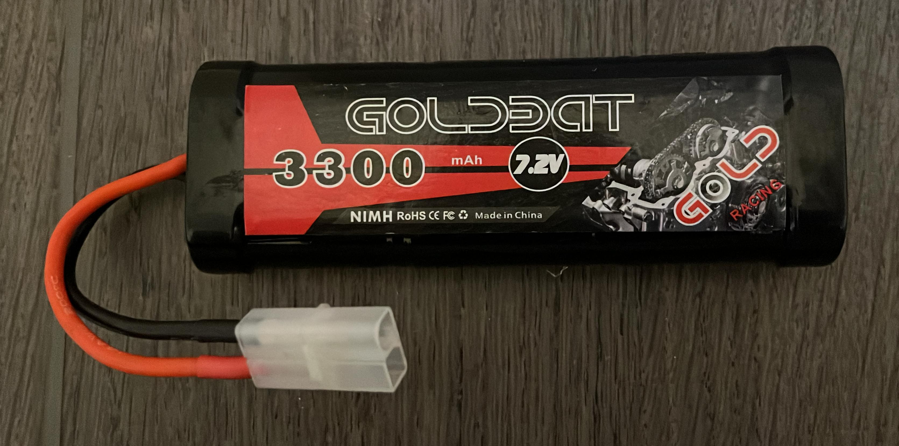
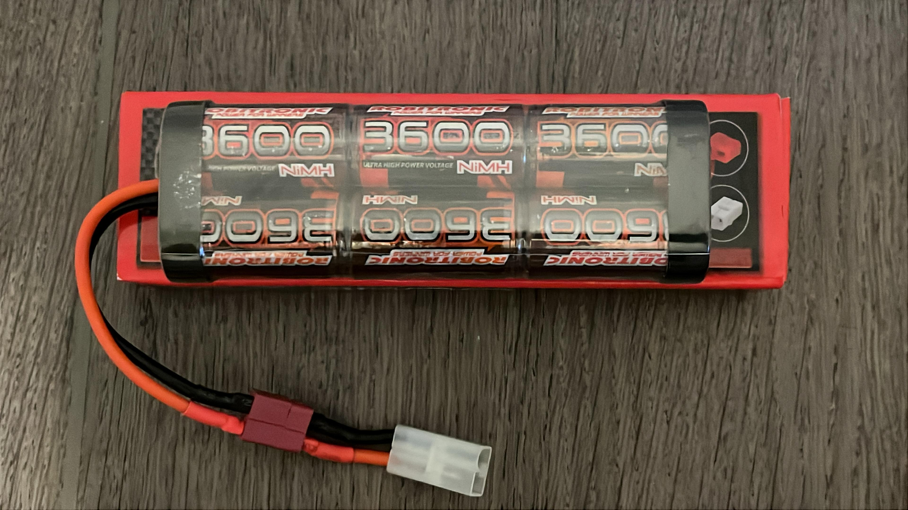
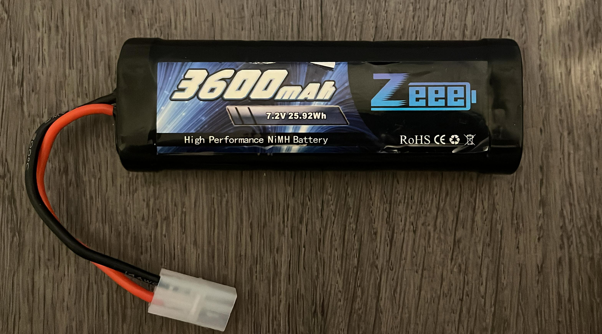

# Voiture Jaune
- Détecteur ultrasonique SRF10
- Lidar A2M12 
- Torque tuned motor 54358
- Raspberry Pi 5 Model B Rev 1.0
- Interrupteur on/off
- Engrenage à pignon 25T (Kit Carson TT-02 Tuning Set)
- Speed gear Set 68T (Kit Carson TT-02 Tuning Set)
- Oil shock absorber set (Kit Carson TT-02 Tuning Set)
- Jeu de roulements à billes (Kit Carson TT-02 Tuning Set)

# Voiture Bleue
- RPLIDAR A2m8-E4.
- Capteur ultrasonique SRF10. 
- Brush ESC Maverick msc-30BR-WP
- Rasberry Pi 3
- Moteur Mabuchi RS-540SH
- Interrupteur on/off
- Engrenage à pignon 25T (Kit Carson TT-02 Tuning Set)
- Speed gear Set 68T (Kit Carson TT-02 Tuning Set)
- Oil shock absorber set (Kit Carson TT-02 Tuning Set)
- Jeu de roulements à billes (Kit Carson TT-02 Tuning Set)
- Raspberry Pi 3 Model B Plus Rev 1.3

# Inventaire des batteries

## Batterie Goldbat
  
**Capacité** : 5000 mAh  
**Quantité** : 12 unités

---

## Batterie Robotronic
  
**Capacité** : 7500 mAh  
**Quantité** : 8 unités

---

## Batterie Zee
  
**Capacité** : 10000 mAh  
**Quantité** : 5 unités
