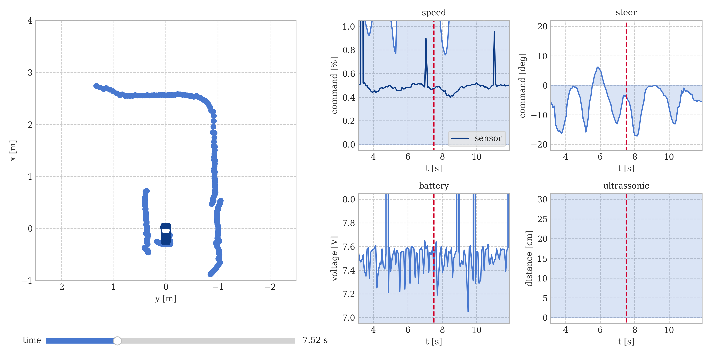
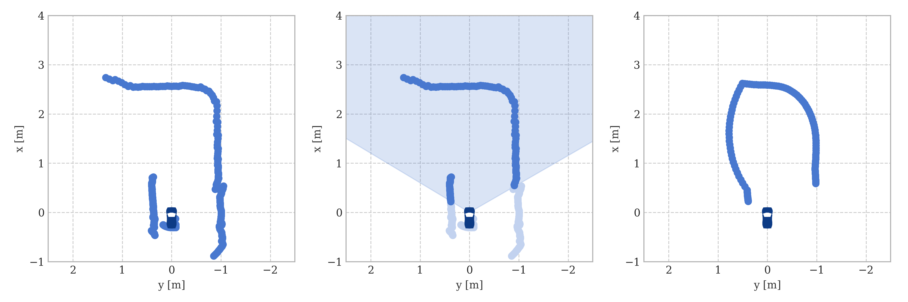
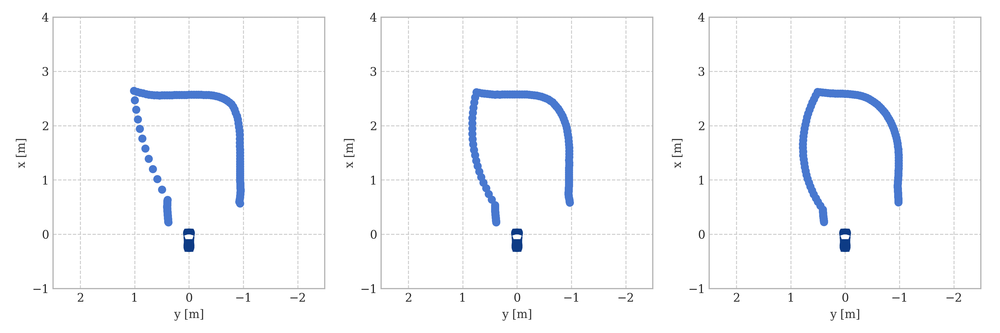
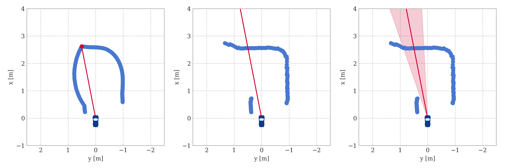
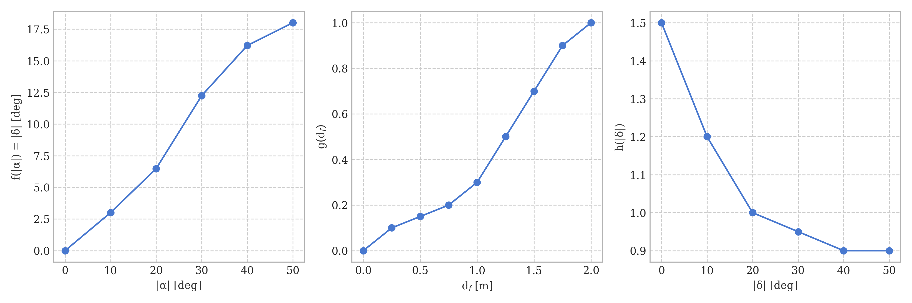

# Voiture Autonome


# Table des matières

* [Premiers pas](#premiers-pas)
  * [Clonage](#clonage)
  * [Installation](#installation)
  * [Configuration](#configuration)
* [Calibration des actionneurs](#calibration-des-actionneurs)
* [Test de communication avec l'Arduino](#test-de-communication-avec-larduino)
* [Exécution du code](#exécution-du-code)
  * [Fichiers associés](#fichiers-associés-2)
  * [Commande dans le terminal](#commande-dans-le-terminal-2)
* [Analyse du *log*](#analyse-du-log)
* [Détails de l'algorithme](#détails-de-lalgorithme)
  * [Architecture](#architecture)
  * [Mesure du lidar](#mesure-du-lidar)
  * [Loi de direction](#loi-de-direction)
  * [Loi de vitesse](#loi-de-vitesse)
  * [Interpolation linéaire](#interpolation-linéaire)
  * [Détection de la marche arrière](#détection-de-la-marche-arrière)
  * [Activation de la marche arrière](#activation-de-la-marche-arrière)
* [Points d'amélioration](#points-damélioration)
* [Boot sur RPi 5](#boot-sur-rpi-5)
  * [Configuration PWM](#configuration-pwm)
  * [Création d'un alias](#création-dun-alias)
* [Contact](#contact)

# Premiers pas

Pour prendre les premiers pas dans le projet, on doit d'abord télécharger le code et préparer tout l'environnement dans lequel on travaillera.

## Clonage

Appuyez sur `CTRL+ALT+T` pour ouvrir un terminal et exécutez les commandes ci-dessous (un par ligne) :

```
cd Desktop
git clone https://github.com/l4cer/Voiture-Autonome.git
cd Voiture-Autonome/code_24
```

## Installation

Créez un environnement virtuel et installez les modules nécessaires :

```
python -m venv venv
source venv/bin/activate (for Linux) or venv\Scripts\activate (for Windows)
pip install -r requirements.txt
```

⚠️ **Important :** pour toutes les sections ci-dessous, exécutez les commandes à l'intérieur du dossier `code_24` et avec l'environnement virtuel activé !

## Configuration

- Dans le fichier `core.py`, indiquez à la ligne 10 si le RPi utilisé est le 5 ou non.
- Dans le fichier `main.py`, indiquez dans les lignes 49 à 52 les paramètres du matériel utilisé, le *baudrate*, etc.
- Dans le fichier `constants.py`, indiquez à la ligne 10 l'orientation du LiDAR (angle dans le repère du LiDAR où se trouve l'avant du véhicule).

# Calibration des actionneurs

Les actionneurs du véhicule sont contrôlés par une technique appelée [PWM](https://learn.sparkfun.com/tutorials/pulse-width-modulation/all) (*Pulse Width Modulation*), où la position du servomoteur et la vitesse du moteur *brushless* dépendent du *duty cycle* appliqué. La calibration consiste précisément à trouver ces valeurs de *duty cycle* qui permettent à la direction de tourner au maximum dans les deux sens, ainsi que la valeur qui limitera la vitesse maximale du véhicule.

## Fichiers associés

📁 `calibrate.py` est le code responsable de la calibration des actionneurs du véhicule (servomoteur pour la direction et moteur *brushless* pour la traction). En exécutant ce code, on pourra contrôler manuellement chacun des actionneurs à partir d'une interface graphique de calibration et de test.

## Commande dans le terminal

```
python calibrate.py
```

Après avoir fermé l'interface graphique, le programme mettra à jour automatiquement le fichier `constants.py`.

# Test de communication avec l'Arduino

La connexion série entre le Raspberry Pi et l'Arduino Nano se fait à l'aide d'un câble USB vers mini USB. Cette même connexion peut être utilisée pour téléverser des programmes du RPi vers l'Arduino.

## Fichiers associés

📁 `arduino.py` est le code responsable de tester la communication série entre le RPi et l'Arduino. En exécutant ce code, on pourra visualiser les mesures des capteurs envoyées de manière sérielle par l'Arduino et reçues par le RPi.

## Commande dans le terminal

```
python arduino.py
```

Les valeurs reçues par la communication série avec l'Arduino seront affichées sous le format :

```
capteur_de_vitesse/distance_de_recul/tension_de_la_batterie
```

Les unités de chaque quantité sont respectivement `m/s`, `cm` et `volt`.

# Exécution du code

Maintenant que tout est correctement préparé, on attache les ceintures ! 🏁

## Fichiers associés

📁 `console.py` est le code responsable de gérer les messages imprimés dans le terminal et de créer et gérer les *logs* de chaque exécution du code principal. Ce code n'est pas exécuté directement, mais utilisé par `main.py`.

📁 `constants.py` est le code responsable de stocker toutes les constantes qui contrôlent le comportement du véhicule. Ce code n'est pas exécuté directement, mais utilisé par d'autres fichiers. Certaines valeurs sont modifiées automatiquement lorsque la calibration des actionneurs est réalisée, minimisant l'effort.

📁 `control.py` est le code responsable de définir les lois de contrôle du véhicule à partir des données sensorielles. On aura une session plus loin pour expliquer en détail les lois de direction et de vitesse. Ce code n'est pas exécuté directement, mais utilisé par `main.py`.

📁 `core.py` est le code responsable de définir certaines structures de base qui seront utiles dans d'autres parties du projet, telles qu'un contrôleur PWM et un gestionnaire de communication série. Ce code n'est pas exécuté directement, mais utilisé par d'autres fichiers.

📁 `main.py` est le code responsable de réaliser toute la routine d'initialisation des capteurs et actionneurs, le contrôle du véhicule pendant la course et la fermeture correcte de toutes les structures initialisées. Il unit les autres composants du projet. En exécutant ce code, le véhicule sera correctement initialisé, entrant dans une routine d'attente jusqu'à ce que le signal GO soit donné pour le début de la course.

## Commande dans le terminal

```
python main.py
```

Appuyez sur `ENTER` pour démarrer et sur `CTRL+C` pour arrêter le code. Deux touches sont utilisées pour éviter les arrêts accidentels du véhicule.

⚠️ **Important :** la commande exacte pour analyser le *log* généré après la fin de la course sera copiée dans le presse-papiers (*clipboard*).

# Analyse du *log*


**Figure 1.** analyse du *log* `v3_qualif_1.csv`.

## Fichiers associés

📁 `multiplot.py` est le code responsable d'interpréter le fichier CSV du *log* et de tracer les graphiques de manière séparée, permettant l'analyse et l'obtention d'aperçus de la manière la plus rapide possible. En exécutant ce code, un écran matplotlib avec 5 graphiques sera affiché. Le graphique le plus à gauche représente la mesure du lidar pour l'instant de temps en question, tandis que les 4 autres graphiques montreront une fenêtre temporelle avec les mesures des métriques respectives (les grandeurs et unités sont correctement identifiées dans l'interface elle-même).

## Commande dans le terminal

Il suffit de coller la commande copiée dans le presse-papiers (*clipboard*).

```
python multiplot.py "../logs/YYYY-MM-DD/HH-MM-SS.csv"
```

Remarquez que `YYYY-MM-DD` représente l'année, le mois et le jour, tandis que `HH-MM-SS` représente l'heure, la minute et la seconde où le *log* a été généré. Il sera unique pour chaque course et garantit que les *logs* ne se chevauchent pas.

Pour modifier le moment dans le temps des graphiques, utilisez le *slider* en bas à gauche. Pour un contrôle plus précis, utilisez les flèches du clavier pour passer itération par itération. Appuyez sur la touche `CTRL` tout en utilisant les flèches du clavier pour augmenter la taille du pas.

# Détails de l'algorithme

## Architecture

L'architecture du code principal peut être abstraite en 3 parties : initialisation, exécution et terminaison.

Le dictionnaire `interface` contient l'objet qui contrôle le lidar, les objets qui contrôlent chacun des PWM et l'objet qui gère la communication série. Ces 4 objets ont été associés à un seul dictionnaire pour faciliter l'accès à ces éléments lorsque d'autres fonctions en ont besoin, de sorte qu'il suffit de les instancier une seule fois et que la référence des objets est utilisée en permanence.

La communication série contient un petit code qui vérifie de manière récursive si cette même communication fonctionne correctement. En cas de problème pendant la course, le code identifiera simplement que l'Arduino n'est plus disponible et enverra des valeurs fictives pour ne pas arrêter le contrôle de la voiture.

⚠️ **Important :** comme le lidar prend environ 1 seconde pour commencer à renvoyer des mesures, une stratégie a été adoptée pour l'initialiser avant de donner le signal de départ, ce qui réduit considérablement la latence.

La manière dont le code principal a été écrit privilégie la scalabilité et la généralité du projet. Pour modifier le comportement du véhicule, il suffit de modifier les lois de contrôle.

## Mesure du lidar

La mesure du lidar se compose d'un vecteur de 360 positions de nombres flottants où l'indice représente l'angle en degrés dans le repère du lidar et la valeur allouée à cette position correspond à la distance respective en mètres. Par exemple, l'élément à la position 90 équivaut à la distance mesurée sur le côté gauche du lidar (pas nécessairement à gauche de la voiture).

❗️**Notez** que les angles sont mesurés dans le sens antihoraire.

Le module `rplidar` possède la fonction `iter_scans()` qui permet d'itérer sur les balayages du lidar. Il est à noter que chaque balayage contiendra les distances mesurées pour un petit intervalle angulaire, de sorte que nous devons regrouper plusieurs de ces balayages pour composer une mesure du lidar. Lorsque le vecteur de distances comporte plus de 60 points non nuls, il est alors considéré que la mesure est suffisante pour progresser dans le code.

⚠️ **Important :** comme le module `rplidar` utilise un générateur pour implémenter la fonction `iter_scans()`, le code de contrôle doit être suffisamment rapide pour ne pas générer d'accumulation de balayages et surcharger le *buffer*.

## Loi de direction

La première chose à faire est de filtrer le nuage de points du lidar et de séparer la région d'intérêt principale. La fonction `filter` sélectionnera uniquement les points qui se trouvent dans un certain champ de vision du véhicule. Ce champ de vision est calculé à partir de l'avant de la voiture et d'une ouverture donnée (la moitié de chaque côté). Ensuite, une convolution sera appliquée pour lisser et réduire les erreurs. On peut comprendre la convolution comme une moyenne entre les points voisins.


**Figure 2.** **(a)** mesure brute du lidar **(b)** champ de vision du véhicule **(c)** nuage de points lissé par une convolution avec `CONVOLUTION_SIZE = 31`.

Augmentez `CONVOLUTION_SIZE` pour augmenter cette voisinage et, par conséquent, le lissage effectué.


**Figure 3.** **(a)** `CONVOLUTION_SIZE = 11` **(b)** `CONVOLUTION_SIZE = 21` **(c)** `CONVOLUTION_SIZE = 31`.

❗️Notez que l'augmentation de la taille de la convolution a tendance à mieux répartir les points, ce qui finit par combler les lacunes.

Maintenant que le nuage de points a été correctement traité, on trouvera l'angle associé au point le plus éloigné. De légères perturbations seront appliquées vers la droite et vers la gauche de cet angle afin de vérifier si la voiture atteindrait d'éventuels coins de la piste. Notez que pour vérifier la présence de coins, on utilise la mesure non filtrée, car le vecteur filtré aura les coins lissés.


**Figure 4.** **(a)** le point le plus éloigné pour le nuage de points lissé **(b)** la direction du point le plus éloigné, mais dans la mesure brute **(c)** la région où la direction sera variée pour rechercher les coins. Dans ce cas, coin non trouvé des deux côtés, donc `delta = 0`.

Supposons qu'un coin a été trouvé à droite du véhicule, `r_angle`, alors on déplacera l'angle de direction vers la gauche afin d'éviter de heurter l'obstacle. Dans ce cas, ce déplacement serait donné par :

```python
delta = -AVOID_CORNER_SCALE_FACTOR * (AVOID_CORNER_MAX_ANGLE - r_angle)
```

Les constantes `AVOID_CORNER_SCALE_FACTOR` et `AVOID_CORNER_MAX_ANGLE` contrôlent le facteur d'augmentation de ce déplacement et la taille de la perturbation angulaire.

Ainsi, on peut calculer l'angle de direction corrigé $\alpha$. Cependant, l'angle de braquage effectif des roues $\delta$ sera une fonction de $\alpha$. Cette fonction $f$ est définie dans `LERP_MAP_STEER` par une carte de points interpolés linéairement.

$$\delta(\alpha) = \text{sign}(\alpha) \cdot f(|\alpha|)$$

⚠️ **Important :** un angle de braquage positif indique que la voiture doit tourner à gauche et une valeur négative à droite.

## Loi de vitesse

Avec le braquage $\delta$ calculé, il est temps de passer à la vitesse. Un petit cône sera filtré dans la région frontale du véhicule afin de calculer sa distance frontale $d_f$. La vitesse $v$ sera une fonction de $d_f$ et de $\delta$ de la manière suivante :

$$v(d_f, \delta) = \kappa + (1-\kappa) \cdot g(d_f) \cdot h(|\delta|)$$

où $\kappa$ est une constante qui détermine l'agressivité de la direction. Plus proche de 1, moins la voiture freinera dans les virages, mais le risque de perdre le contrôle est également plus élevé. Les fonctions $g$ et $h$ sont définies respectivement dans `LERP_MAP_SPEED_DIST` et `LERP_MAP_SPEED_ANGL` à l'aide de cartes de points interpolés linéairement.

❗️**Remarquez** que la fonction $h$ vise à accélérer dans les lignes droites (petit braquage) et à freiner encore plus dans les virages, augmentant la réactivité du véhicule.

## Interpolation linéaire

Tout au long du code, les fonctions $f$, $g$ et $h$ sont utilisées pour convertir une grandeur en une autre. Ces fonctions sont déterminées de manière empirique, donc des cartes d'interpolation sont utilisées, stockées sous forme de tableaux avec $n$ lignes et 2 colonnes. La $i$-ème ligne représente le $i$-ème point de la carte, tandis que les valeurs dans la ligne représentent l'entrée et la sortie de la fonction, respectivement.
$$f(x_i) = y_i \qquad i=1,2,\dots,n \qquad f(x > x_n) = y_n$$
$$x \in [x_i, x_{i+1}] \Rightarrow f(x) = y_i + (y_{i+1} - y_i) \cdot \dfrac{x - x_i}{x_{i+1} - x_i}$$


**Figure 5.** visualisation des fonctions mentionnées.

## Détection de la marche arrière

L'activation de la marche arrière peut se produire dans deux scénarios distincts :

1. le véhicule est à l'arrêt (capteur de vitesse nul) et le temps écoulé depuis la dernière activation est supérieur à 2 secondes ;
2. en obstacle frontal a été identifié pendant une période suffisante, c'est-à-dire pendant au moins `REVERSE_CHECK_COUNTER` itérations.

Pour vérifier la présence d'un obstacle frontal, une zone de vérification rectangulaire est utilisée plutôt qu'un secteur circulaire, il est donc nécessaire de convertir la mesure du lidar de coordonnées polaires en coordonnées cartésiennes. Cette zone aura une largeur fixe et approximativement égale à la largeur de la voiture, cependant sa longueur variera avec la vitesse du véhicule.

Si la voiture roule plus vite, il est nécessaire d'augmenter la distance de vérification en raison du léger délai qui existe dans le freinage total du véhicule. La longueur varie selon la fonction mappée dans `LERP_MAP_LENGTH`.

Si un nombre minimum de points `MIN_POINTS_TO_TRIGGER` se trouve dans cette zone rectangulaire, on conclut qu'il y a un obstacle frontal. Cependant, cet obstacle pourrait être simplement une voiture qui a freiné brièvement puis a rapidement dégagé le chemin. Pour éviter l'activation inutile de la marche arrière, il est nécessaire de vérifier si cet obstacle est resté pendant un minimum de itérations consécutives `REVERSE_CHECK_COUNTER`. Si tel est le cas, la marche arrière est alors enclenchée.

## Activation de la marche arrière

Lors de l'activation de la marche arrière, le code effectuera les actions suivantes :

1. arrêter le lidar pour éviter les erreurs d'obstruction du *buffer* ;
2. notifier l'ESC (contrôleur du moteur) qu'il doit fonctionner en mode inverse ;
3. vérifier si l'arrière est dégagé pour effectuer la marche arrière ;
4. décider du côté sur lequel les roues tourneront ;
5. réactiver le lidar tout en effectuant correctement la marche arrière.

⚠️ **Important :** la procédure de notification de l'ESC varie d'un modèle à l'autre, il s'agira donc probablement d'un point de divergence entre les codes des deux voitures. Le `time.sleep(0.03)` peut être insuffisant pour notifier correctement l'ESC, il peut donc être nécessaire d'augmenter légèrement cette valeur.

La vérification avant de reculer était une exigence pour l'homologation et consiste à attendre tant qu'il y a un obstacle à l'arrière. En augmentant le `range` du `for`, on augmente l'intervalle maximal d'attente avant que la marche arrière ne soit autorisée. Pour l'homologation, il peut être intéressant d'utiliser une grande valeur, mais une petite valeur pour les courses elles-mêmes.

Les roues seront tournées afin d'améliorer le positionnement du véhicule après la marche arrière. Le côté est choisi en observant les côtés du véhicule. Par exemple, si le côté droit est plus dégagé (distance moyenne plus grande) que le côté gauche, les roues seront tournées vers la gauche et vice versa.

Pendant que la voiture recule, il vérifie également si l'espace reste libre pour pouvoir continuer. Si un obstacle obstrue l'arrière du véhicule, la marche arrière est interrompue et la voiture reprend sa marche en avant.

⚠️ **Important :** le lidar prend environ 1 seconde pour s'initialiser après arrêter. Ainsi, il est intéressant de profiter de ce temps d'initialisation pour commencer à reculer.

# Points d'amélioration

La performance lors de la compétition CoVAPSy 2024 était excellente, mais voici quelques points qui pourraient être améliorés pour le prochain projet :

- Déviation plus efficace des obstacles fixes
- Identification du sens correct de la piste pour éviter de rouler à contresens

Pour dévier des obstacles de manière plus efficace, il peut être intéressant de revoir la loi de direction, en particulier le calcul du `delta`. Ma supposition est que lorsque l'obstacle est très proche, `r_angle = l_angle = 0`, ce qui entraîne toujours l'entrée dans le `else` et un virage à droite. Dans ce cas, il pourrait être intéressant de réfléchir à une solution pour résoudre cette impasse en cas d'égalité.

Pour identifier le sens correct de la piste, plusieurs approches sont possibles : caméra pour identifier la couleur des murs, SLAM (*Simultaneous Localisation And Mapping*), odométrie avec IMU (*Inertial Measurement Unit* composée d'un gyroscope et d'un accéléromètre), entre autres. Ne vous limitez pas à cela, utilisez-le simplement comme point de départ pour d'autres approches.

# Boot sur RPi 5

Utilisez le [`2023-12-05-raspios-bookworm-arm64.img.tar.xz`](https://downloads.raspberrypi.com/raspios_arm64/images/raspios_arm64-2023-12-06/2023-12-05-raspios-bookworm-arm64.img.xz) pour démarrer le RPi 5.

⚠️ **Important :** le noyau utilisé doit être le 6.1 et il ne faut pas effectuer de mises à jour, car le noyau 6.6 présentait certains problèmes au moment du développement (mars 2024).

## Configuration PWM

Exécutez la commande ci-dessous pour éditer le fichier en question :

```
sudo nano /boot/firmware/config.txt
```

À la fin du fichier, ajoutez les lignes suivantes :

```
# Enable PWM
dtoverlay=pwm-2chan,pin=12,func=4,pin2=13,func2=4
```

Appuyez sur `CTRL+O` pour enregistrer et `CTRL+X` pour quitter l'éditeur de texte. Redémarrez le RPi.

## Création d'un alias

Exécutez les commandes ci-dessous pour créer et éditer un fichier de règles :

```
sudo touch /etc/udev/rules.d/99-devices.rules
sudo nano /etc/udev/rules.d/99-devices.rules
```

Ajoutez les lignes suivantes :

```
SUBSYSTEM=="tty", ATTRS{idVendor}=="2341", ATTRS{idProduct}=="8057", SYMLINK+="ttyACM"
SUBSYSTEM=="tty", ATTRS{idVendor}=="10c4", ATTRS{idProduct}=="ea60", SYMLINK+="ttyUSB"
```

Appuyez sur `CTRL+O` pour enregistrer et `CTRL+X` pour quitter l'éditeur de texte. Redémarrez le RPi ou débranchez et rebranchez les périphériques.

Les valeurs `idVendor` et `idProduct` peuvent être trouvées en exécutant la commande `dmesg`, mais il y a une forte probabilité qu'elles soient les mêmes que celles de la commande ci-dessus.

Ainsi, il n'est pas nécessaire de spécifier si le LiDAR est connecté au port `ttyUSB0` ou `ttyUSB1`, par exemple, évitant les erreurs où le port change pendant l'exécution du code.

# Contact

En cas de doutes, n'hésitez pas à envoyer un message !

> Filipe **LACERDA**
>
> filipe.lacerda@ensta-paris.fr
>
> +33 7 82 74 86 81
